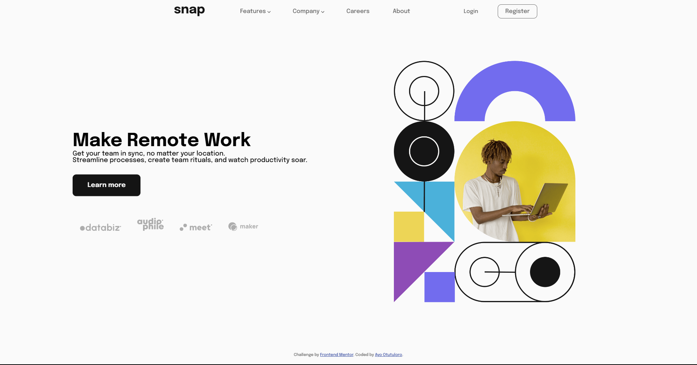

# Frontend Mentor - Intro section with dropdown navigation solution

This is a solution to the [Intro section with dropdown navigation challenge on Frontend Mentor](https://www.frontendmentor.io/challenges/intro-section-with-dropdown-navigation-ryaPetHE5). Frontend Mentor challenges help you improve your coding skills by building realistic projects. 

## Table of contents

- [Overview](#overview)
  - [The challenge](#the-challenge)
  - [Screenshot](#screenshot)
  - [Links](#links)
  - [Built with](#built-with)
  - [What I learned](#what-i-learned)
  - [Useful resources](#useful-resources)
- [Author](#author)
- [Acknowledgments](#acknowledgments)

## Overview

### The challenge

Users should be able to:

- View the relevant dropdown menus on desktop and mobile when interacting with the navigation links
- View the optimal layout for the content depending on their device's screen size
- See hover states for all interactive elements on the page

### Screenshot

### Links

- Solution URL: [Add solution URL here](https://your-solution-url.com)
- Live Site URL: [Add live site URL here](https://your-live-site-url.com)

### Built with

- Semantic HTML5 markup
- CSS custom properties
- Flexbox

### What I learned

I learned how to make dropdown menus, as well as creating side navigation bars. I also improved my responsive design skills.

### Useful resources

- [W3Schools](https://www.w3schools.com) - This helped me with the creation of the sidebar nav. It was very informative and useful.

## Author

- Website - [Ayo Otutuloro](https://darkerarcher.netlify.app/)
- Frontend Mentor - [@darkerarcher](https://www.frontendmentor.io/profile/DarkerArcher)
- Twitter - [@darkerarcher](https://www.twitter.com/darkerarcher)

## Acknowledgments

I'd like to thank my best friend for their constant motivation and support during this project. I'd also like to thank my cousin for his kind words and encouragement.
